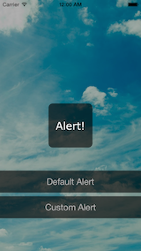
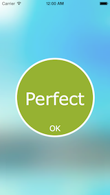

# ZZCustomAlertView

[](https://travis-ci.org/zzdjk6/ZZCustomAlertView)
[](http://cocoapods.org/pods/ZZCustomAlertView)
[](http://cocoapods.org/pods/ZZCustomAlertView)
[](http://cocoapods.org/pods/ZZCustomAlertView)

ZZCustomAlertView is an ios alert view that you can totally customize it.

## Usage

To run the example project, clone the repo, and run `pod install` from the Example directory first.

Here is a brief introduction.

To generate and show a new plain ZZCustomAlertView, write:

```objc
ZZCustomAlertView *alert = [ZZCustomAlertView alertViewWithParentView:self.view andContentView:nil];
[alert show];
```
The code above give you an alert view like bellow, you can tap anywhere to dismiss it.



Remember you should always give it a parentView. If you don't give it a contentView, it will generate a plain default one.

To generate a customized ZZCustomAlertView, there is an example:

```objc
UIImage *img = [UIImage imageNamed:@"Perfect Button"];
UIButton *btn = [UIButton buttonWithType:UIButtonTypeCustom];
btn.frame = CGRectMake(0, 0, img.size.width, img.size.height);
[btn setImage:img forState:UIControlStateNormal];
[btn addTarget:self action:@selector(customButtonPressed) forControlEvents:UIControlEventTouchUpInside];
    
ZZCustomAlertView *alert = [ZZCustomAlertView alertViewWithParentView:self.view andContentView:btn];
alert.shouldBlurBackground = YES;
alert.allowTapBackgroundToDismiss = NO;
alert.shadowColor = [UIColor whiteColor];
alert.shadowAlpha = 0.1f;
[alert show];
```
The code above just give you an alert view with a single image button, with blurred background, like bellow.



There are some parameters you can use to customize ZZCustomAlertView, look at the header file and you can get all of them with detail comment.

```objc
/** If set to YES, the background will be blured, using iOS 8 VisualEffect, default is NO. */
@property(nonatomic, assign) BOOL shouldBlurBackground;

/** If set to YES, tap anywhere on the alert view (include background) will dismiss the alert view, default is YES. */
@property(nonatomic, assign) BOOL allowTapBackgroundToDismiss;

/** the alpha of the modal shadow, default is 0.3f. */
@property(nonatomic, assign) CGFloat shadowAlpha;

/** the color of the modal shadow, default is black. */
@property(nonatomic, strong) UIColor *shadowColor;

/** the content view of the alert view, you can put any view you write here. */
@property(nonatomic, strong) UIView *contentView;

/** the parent view of the alert view, you have to provide one. */
@property(nonatomic, strong) UIView *parentView;
```

And there are some methods to show and dismiss ZZCustomAlertView:

```objc
/**
 *  Show alert view.
 */
- (void)show;

/**
 *  Dismiss alert view.
 */
- (void)dismiss;

/**
 *  Show alert view with a block which will be executed when alert view finish show animation
 *
 *  @param completion A block which will be executed when alert view finish show animation
 */
- (void)showWithCompletionBlock:(void (^)(BOOL finished))completion;

/**
 *  Dismiss alert view with a block which will be executed when alert view finish dismiss animation
 *
 *  @param completion A block which will be executed when alert view finish dismiss animation
 */
- (void)dismissWithCompletionBlock:(void (^)(BOOL finished))completion;
``` 

You can get the alert view on present by call:

```objc
/**
 *  Get the alert view on present.
 *
 *  @return ZZCustomAlertView instance or nil.
 */
+ (instancetype)alertViewOnPresent;
```


## Requirements

* iOS 8 SDK
* Use ARC

## Installation

ZZCustomAlertView is available through [CocoaPods](http://cocoapods.org). To install
it, simply add the following line to your Podfile:

```ruby
pod "ZZCustomAlertView"
```

## Author

zzdjk6, zzdjk6@126.com

## License

ZZCustomAlertView is available under the MIT license. See the LICENSE file for more info.
